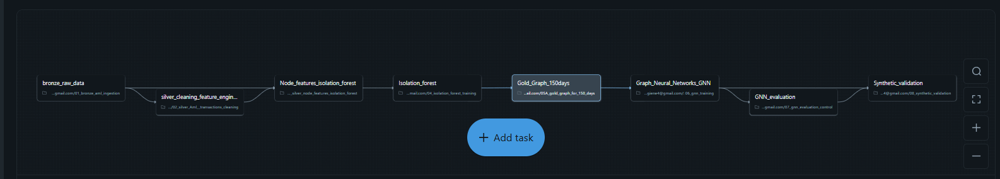

[README.md](https://github.com/user-attachments/files/24984167/README.md)
# 🏦 Bank Fraud Detection using Graph Neural Networks (GNN)

## 📌 Overview
This project implements an end-to-end bank fraud detection system using **Graph Neural Networks (GNNs)** and **Isolation Forest** on synthetic banking data.

The system is built on **Databricks** using a layered **Bronze → Silver → Gold** architecture 

---

## 🧠 Architecture

---

## 🔁 Pipeline Workflow

1. **Bronze Layer**
   - Raw transaction & account ingestion

2. **Silver Layer**
   - Cleaning & feature engineering
   - Aggregations (total amount, avg amount, unique targets)

3. **Anomaly Detection**
   - Isolation Forest to flag anomalous accounts

4. **Gold Layer**
   - Graph construction (150-day window)
   - Node & edge preparation

5. **GNN Model**
   - Learns network-based fraud patterns
   - Outputs fraud probability per account

6. **Evaluation & Validation**
   - GNN evaluation
   - Synthetic data validation

---

## 🧪 Why GNN?
Traditional ML treats transactions independently.
GNN models capture **relationships between accounts**, devices, IPs, and transactions — enabling detection of:
- Money laundering
- Mule accounts
- Coordinated fraud rings

---

## 🔍 Why Isolation Forest?

In real-world banking systems, **labeled fraud data is scarce, imbalanced, and constantly evolving**. 
Because of this, relying only on supervised models can miss emerging fraud patterns.

We use **Isolation Forest** as an unsupervised anomaly detection step **before** the Graph Neural Network (GNN) 

---

## 🛠️ Tech Stack
- Databricks
- PySpark
- Graph Neural Networks
- Isolation Forest
- Delta Lake
- Python

---

## 📂 Repository Structure
See images/ notebooks/ README.md

---

## 🚀 Future Work
- Real-time ingestion
- Streaming graph updates
- Model retraining automation

---

## 👤 Author
Vishv Pandya
